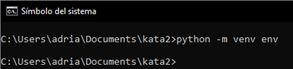
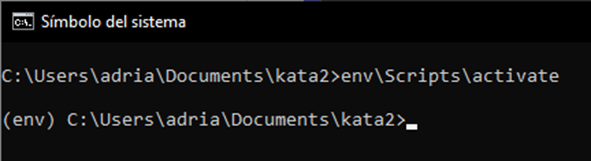
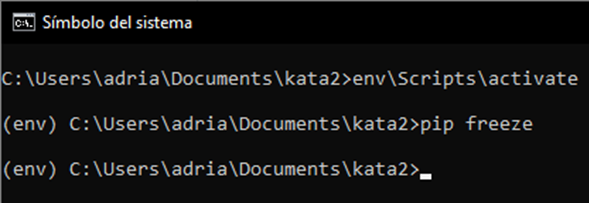
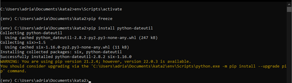
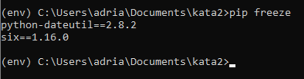
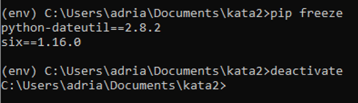

## Ejercicio - Crear un paquete

### Crear un entorno virtual

Crea un entorno virtual mediante ``venv``

* Ejecutar en su terminal: ``python3 -m venv env`` o bien ``python -m venv env``

* Ejecuta el comando para activar el entorno virtual: ``source env/bin/activate``

### Instalar una biblioteca

* Ejecuta el comando ``pip freeze`` para ver las bibliotecas instaladas en tu entorno:

* Ejecuta el comando ``pip install`` para instalar una biblioteca:

* Vuelve a ejecutar ``pip freeze`` para ver cómo ha cambiado tu lista de bibliotecas:

### Desactivar un entorno virtual

Ejecuta el comando ``deactivate``:

